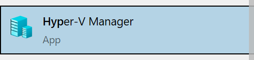
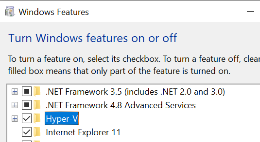
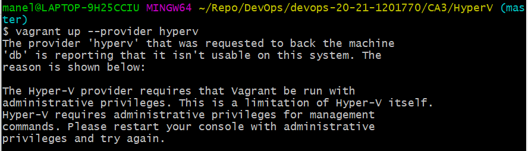
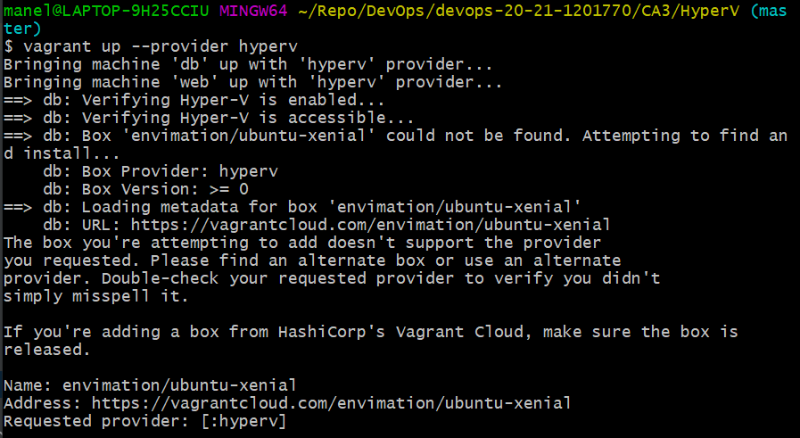
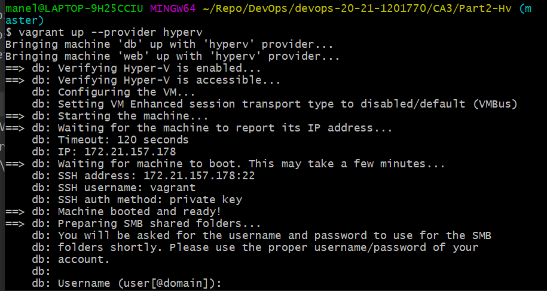
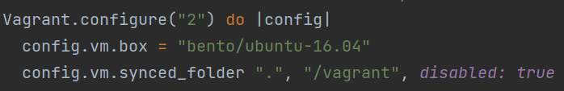
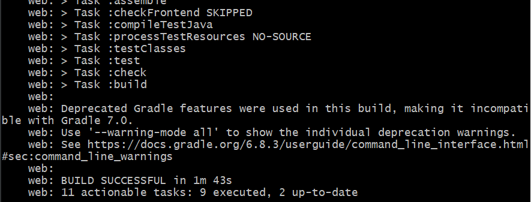
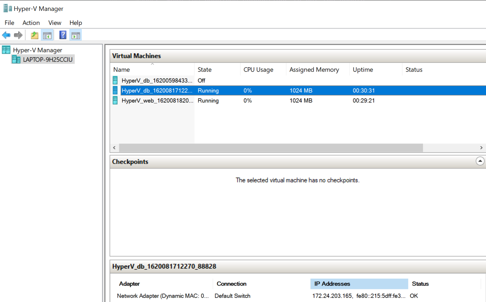
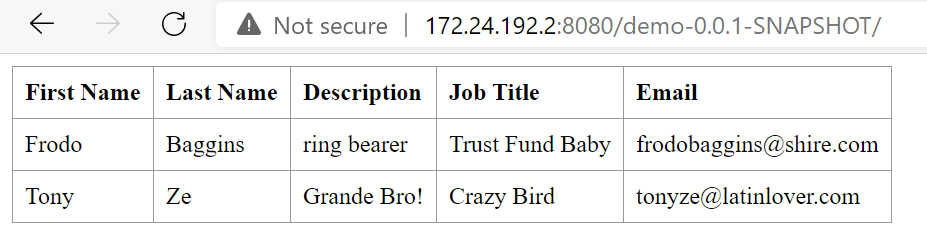
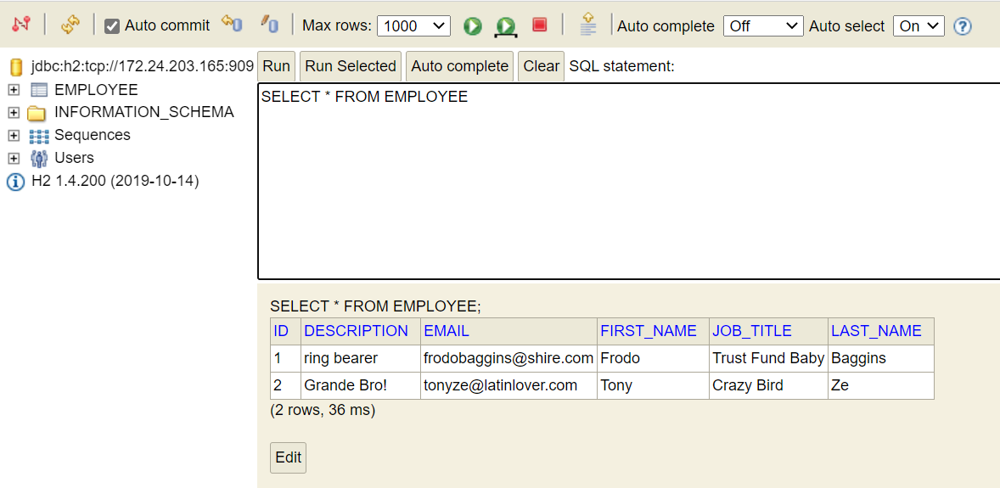

CA3: Part2 README
==============

The Readme is structure in 2 sections:

- **Alternative Analysis**: this section is an analysis of hypervisor alternatives to VirtualBox;
- **Alternative Implementation**: this section is a repeat of the first section, using an alternative hypervisor;
  
CA3: Alternative Analysis
=====

As far as Virtualization tools, there are three that seem to control most of the market: Oracle's VirtualBox, Microsoft's Hyper-V and VMware's, well, VMware (we will mostly focus on VMWare Workstation). These are the tools which we will focus on.

Hypervisors are there to provide a layer of separation and abstraction between the host machine and the virtual machine, while the host machine shares its resources(memory, processing power, etc...) between the multiple VMs.

**Hypervisor types**
---
There are two types of hypervisors, **Type1** and **Type2**.

- **Type1**: These hypervisors run directly on the host hardware and generally don't require the installation of any additional external software to manage. This essentially means that the hypervisor doesn't have to load the underlying OS or device drivers from it.

- **Type2**: These hypervisors are installed and run on top of the host OS. They rely on the host OS to manage access to its resources, like CPU and memory.

Type 1 hypervisors are considered more secure and generally faster. Since they don't have the underlying security concerns associated with the host OS and don't have the extra step of waiting for the host OS to handle the calls to CPU, memory, networks and storage.
  
To start of this analysis of the Hypervisor alternative we will start by talking about VirtualBox:

**Vagrant**
---
According to HashiCorp, the makers of Vagrant, "Vagrant is a tool for building and distributing development environments.".

These development environments can be run on local virtualization platforms, in the cloud or in containers, such as docker. It works on all main OSs, such as Windows, MacOS and Linux - interchangeably.

The great advantage is that it makes the development environments portable and removes the risk of differences in development environments leading to issues.

Out of the box, Vagrant comes with support for VirtualBox, Docker and Hyper-V, but other virtualization platforms or containers are supported via the use of plugins. Importantly, not all features work the same on every provider.

**Comparisons**
---
VirtualBox is Type2 hypervisors, as opposed to Hyper-V which is Type-1. VMWare has solutions for both kinds, VMWare ESX for Type1 and VMWare Workstation or VMWare Workstation Player for Type2.

Hyper-V is integrated in every Windows OS(and only available on Windows) for professional or education use, so it is more easily available, but all 3 hypervisors are free to use (in the case of VMWare, only Workstation is free and only for one virtual machine).

In terms of **performance** it seems that VirtualBox is lagging behind its competitors, but all 3 do the trick if the underlying hardware is good enough.

In terms of **ease-of-use**, Hyper-V has a drawback in which it can only be used with Administrator privileges and if Hyper-V is activated, every other hypervisor is unable to run. Enabling and disabling it is easy enough, but its an extra step and requires a restart of the host machine.

**Functionality**-wise, VirtualBox and Hyper-V allow you to take snapshots of the machine as it is currently, preserving the current state of the VM, and going back to that exact state as needed.

In terms of **limitations**, remember that Hyper-V, being made by Microsoft, doesn't support MacOS virtualization. Furthermore, as the implementation of the project using Hyper-V showed, Vagrant can't set the VMs IPs through the Vagrantfile ([see more here](https://www.vagrantup.com/docs/providers/hyperv/limitations)).

CA3: Alternative Implementation
=====

The chosen alternative was Hyper-V, mostly because it was supported by Vagrant out of the box, but also because it's a Type1 hypervisor, and we believed it was already installed on our host machine (spoiler: it wasn't).

**0. Install Hyper-V**
---
So, if you don't have a fancy Windows version, Hyper-V doesn't come pre-installed and accessible. The easiest way we found was to create a bat file and ran it as administrator to install it:

```
pushd "%~dp0"
 dir /b %SystemRoot%\servicing\Packages\*Hyper-V*.mum >hv.txt
 for /f %%i in ('findstr /i . hv.txt 2^>nul') do dism /online /norestart /add-package:"%SystemRoot%\servicing\Packages\%%i"
 del hv.txt
 Dism /online /enable-feature /featurename:Microsoft-Hyper-V -All /LimitAccess /ALL
 pause
```
We can now find it in the Start menu:



Installing Hyper-V kind of locks you into using it exclusively as a hypervisor. The easiest way to disable Hyper-V is in the Control Panel -> Turn Windows features on and off -> tick off Hyper-V:



**1. Setup Vagrantfile**
---

**1.1. Download Vagrantfile from the supplied repository**

To simplify, you can just copy the Vagrantfile from CA3/Part2, as it should be the one needing fewer changes.
___

**1.2. For this alternative we will be using the Repository for CA3/Part2 as almost everything is set up as needed**

So no need to up the Vagrantfile regarding the Repository directory.

___
**1.3. Check if everything is working as intended by running the application and verifying if it is displaying the correct information**

On a terminal, inside the appropriate folder where the Vagrantfile is saved:
```
vagrant up --provider hyperv
```
The provider tag forces vagrant to use Hyper-V.



Apparently there's a limitation with Hyper-V that requires it to be run as administrator.
___
**1.4. Run Git Bash as administrator and try the previous command again:**

As predicted, the box we are trying to use (Ubuntu Xenial) isn't compatible with HyperV:


We need to find a suitable box to use.
___
**1.5. Update Vagrantfile with compatible box:**

After searching there's a similar box using Ubuntu 16.04 which we will try to use.

[Link to Ubuntu Bento 16.04 Box](https://app.vagrantup.com/bento/boxes/ubuntu-16.04)

Now we can update Vagrantfile to use this specific box, by changing every instance of ```"envimation/ubuntu-xenial"``` to ```"bento/ubuntu-16.04"```.

___
**1.6. Re-raise the VMs:**
```
vagrant up --provider hyperv
```
Apparently this box makes use of SMB(Server Message Block) which we want to avoid, as we don't need them:



To avoid using shared folders we can add the following line to the Vagrantfile:
```
config.vm.synced_folder ".", "/vagrant", disabled: true
```


Re-raise again!

**1.7. The sweet relief of success:**




___
**2. Make the required corrections to get the gradle project running properly.**
---

Remember that one of the limitations of Hyper-V is that you can't set static IPs when raising VMs through Vagrant?

**2.1. That means we need to update the application.properties file, so it reflects the correct ip of the db VM:**

Since we are using the same project as in CA3/Part2 and we don't want to force changes on that project just because we are lazy we must go into the web VM and change the file in there:

```
vagrant ssh web
```

**2.2. Access the application.properties file:**
```
nano devops-20-21-1201770/CA3/Part2/src/main/resources/application.properties
```
Check the IP in the db VM(you can do this in Hyper-V Manager or by accessing the db VM through ssh and using the ```ip a``` command)



**2.3. Change the IP in spring.datasource.url:**

```
spring.datasource.url=jdbc:h2:tcp://172.24.203.165:9092/./jpadb;DB_CLOSE_DELAY=$
```

**2.4. Exit the VM and reload.**
___

**3. Bask in your success!**
---

You can now access your database through your browser, just like you did previously! Just don't forget to change the IP, so it matches the web VM!





___
**4. We're done with the final part of CA3!**
===


