CA3: Part1 README
==============

The Readme is structure in 1 section:

- **CA3 Part1**: this section works like a step-by-step tutorial of the process followed in this CA;

ubuntu username: ca3_1201770
ubuntu password: billabong

CA3: Part1
=====

**1. Create VM as described in lecture**
---
**1.1 Validate VM is working as expected by running Spring Boot and confirming we can access the VM using SSH:**

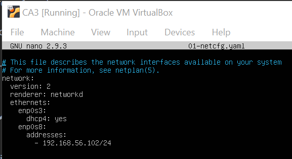

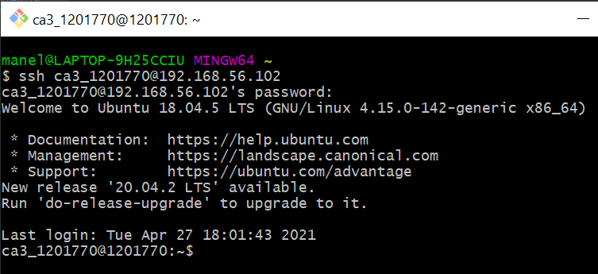
___
**2. Clone your repository into the VM**
---
```
git clone https://manel_rga@bitbucket.org/manel_rga/devops-20-21-1201770.git
```
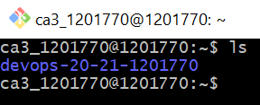
___
**3. Run Spring Boot from CA1**
---
**3.1. Go to CA1 project folder and run the Spring Boot run command:**

*Thank your past self for including the maven wrapper in the repository, meaning you now don't have to install maven.*
```
./mvnw spring-boot:run
```

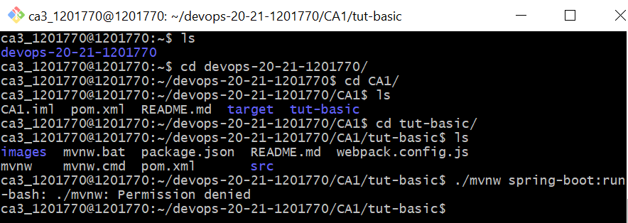
*Get denied, because you forgot give the mvnw folder execute permission.*
___
**3.2. Give folder execute permission:**
```
chmod +x mvnw
```
*This seems to have done the trick.*
___
**3.3. Re-run Spring Boot:**
```
./mvnw spring-boot:run
```
___
**3.4. Verify if front end is showing the desired information:**

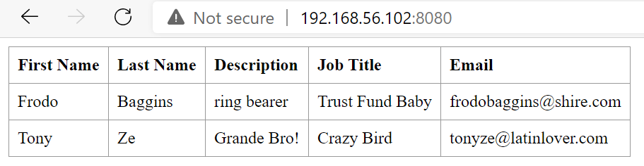

*Celebrate because everything is working as intended and with minimal fuss.*
___
**4. Run the Part1 section of CA2 using Gradle**
---
**4.1. Change to the correct folder:**

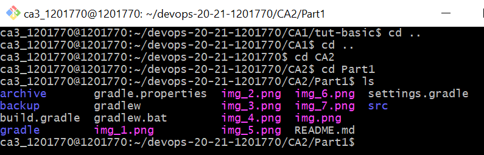
___
**4.2. Give execute permissions to gradlew:**

*Hah, we've learnt our trick with Maven!*
```
chmod +x gradlew
```
___
**4.3. Build the project:**
```
./gradlew build
```
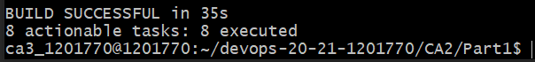
___
**4.4. Change the gradle.build file to use correct IP argument in the runClient task:**
```
nano build.gradle
```

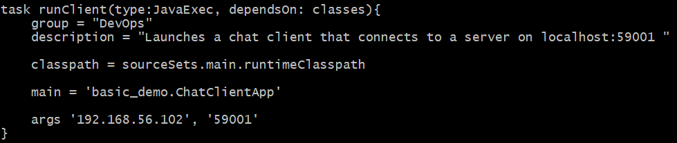
___
**4.5. Run the runServer task on the VM, and the runClient task on the host machine**

On the VM:
```
./gradlew runServer
```
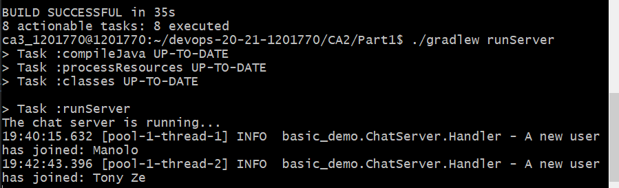

On the host machine run the task runClient in two terminal instances:

We must run the client in the host machine for two reasons:

- The client needs a graphical interface;
- We need to run two clients to simulate a conversation (although it might be possible to run the task twice using different sessions inside the VM, which wasn't tried due to lack of knowledge)

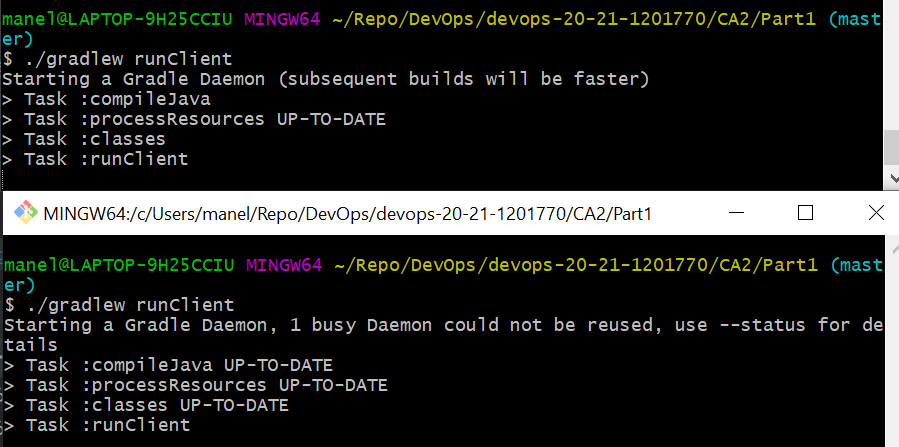

Have a nice conversation with yourself:

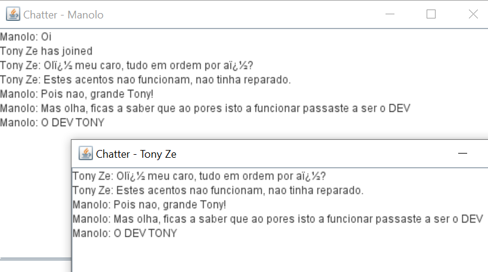
___
**4.6. On the host machine, run the task to copy the project, copyProject:**

Realise you had included the result of this task on the repository, so delete the directory and run the task

```
rm -r archive
rm -r backup
```

```
./gradlew copyProject
```

The copy folder was created!

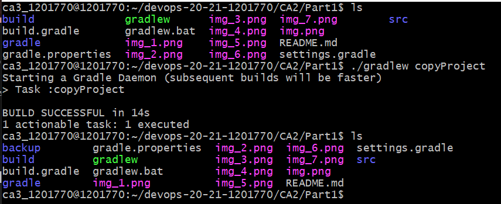
___
**4.7. On the host machine, run the task to zip the project, archiveProject:**
```
./gradlew archiveProject
```

The archive folder was created!

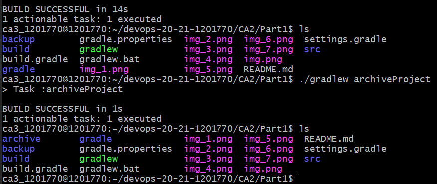
___
**5. We're done with this part of CA3!**
---


