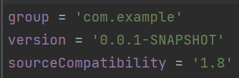

CA3: Part2 README
==============

The Readme is structure in 1 section:

- **CA3 Part2**: this section works like a step-by-step tutorial of the process followed in this CA;

CA3: Part2
=====

**1. Setup Vagrantfile**
---
**1.1. Download Vagrantfile from the supplied repository**
___

**1.2. Go through the Vagrantfile and make the appropriate changes so we can setup the VMs**

- Change the repository which should be cloned to the VMs:


___
**1.3. Check if everything is working as intended by raising the VMs and verifying if it is displaying the correct information**

On a terminal, inside the appropriate folder where the Vagrantfile is saved:
```
vagrant up
```
*Realise that the Repository wasn't public, also the path you inputed was incorrect*
___
**1.4. Make the Repository public and correct the path to the project:**

```
# Change the following command to clone your own repository!
git clone https://manel_rga@bitbucket.org/manel_rga/devops-20-21-1201770.git
cd devops-20-21-1201770/CA2/Part2
```

___
**1.5. Reload the Vagrantfile:**
```
vagrant reload --provision
```
___
**1.6. It seems that the Vagrantfile is now OK**

But not the gradle project:


For now, I'll take it and commit it.
___
**2. Correct the Java JDK issue - compileJAVA**
---
**2.0.1. Realise we could have copied the project onto CA3/Part2**

This way we can edit the files locally, push them to the repository and they will be updated at the same time in the VMs we are creating.

This means we have to destroy the VMs and reload.

```
vagrant destroy db
vagrant destroy web
```
___
**2.1. Change the sourceCompatibility line in build.gradle to "1.8":**


___
**2.2. We now have a successful build!**


**3. Add support for building the .war file**
---
**3.1. Added ServletInitializer class**
```java
public class ServletInitializer extends SpringBootServletInitializer {

    @Override
    protected SpringApplicationBuilder configure(SpringApplicationBuilder application) {
        return application.sources(ReactAndSpringDataRestApplication.class);
    }
}
```
___
**3.2. Add war id to build.gradle**
```
id 'war'
```

```
providedRuntime 'org.springframework.boot:spring-boot-starter-tomcat'
```

___
**4. Add H2 support**
---
**4.1. Add H2 console support in application.properties**
```
spring.data.rest.base-path=/api
spring.datasource.url=jdbc:h2:mem:jpadb
spring.datasource.driverClassName=org.h2.Driver
spring.datasource.username=sa
spring.datasource.password=
spring.jpa.database-platform=org.hibernate.dialect.H2Dialect
spring.h2.console.enabled=true
spring.h2.console.path=/h2-console
```
___
**4.2. Add line in application.properties to allow remote access to H2**
```
spring.h2.console.settings.web-allow-others=true
```
___
**4.3. Add application context path**
In app.js:
```java
componentDidMount() { // <2>
	client({method: 'GET', path: '/basic-0.0.1-SNAPSHOT/api/employees'}).done(response => {
	    this.setState({employees: response.entity._embedded.employees});
	});
}
```


We need to change Spring Boot's context path, so in application.properties:
```
server.servlet.context-path=/basic-0.0.1-SNAPSHOT
```
___
**4.4. Fix the reference to CSS in index.html**

This is a complex one, so pay attention. How it starts:
```
    <link rel="stylesheet" href="/main.css" />
```
How it ends:
```
    <link rel="stylesheet" href="main.css" />
```

Notice the difference? Alternatively just look at the difference in bitbucket which makes it a bit more clear:


___
**4.5. Change application.properties to use the appropriate url for the database.**

Comment the original remote url and add the new one:
```
#spring.datasource.url=jdbc:h2:mem:jpadb
spring.datasource.url=jdbc:h2:tcp://192.168.33.11:9092/./jpadb;DB_CLOSE_DELAY=-1;DB_CLOSE_ON_EXIT=FALSE
```
This creates the database on the vagrant home folder.
___
**4.6. Change application.properties so that the tables aren't dropped in each execution.**

Add the following line:
```
spring.jpa.hibernate.ddl-auto=update
```
___
**4.7. EUREKA! It works as intended:**


5. We're done with this part of CA3!
---


